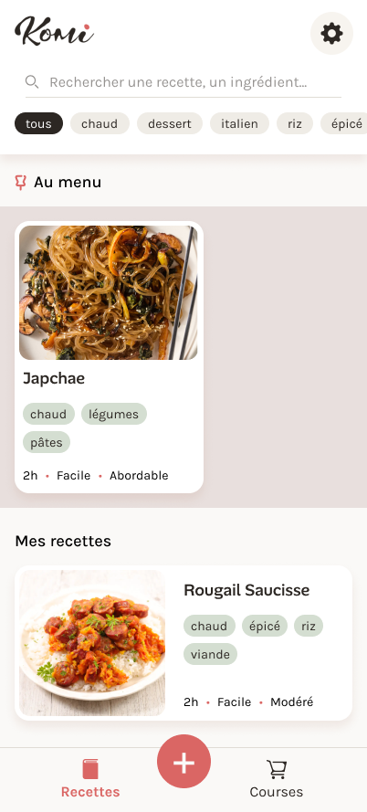
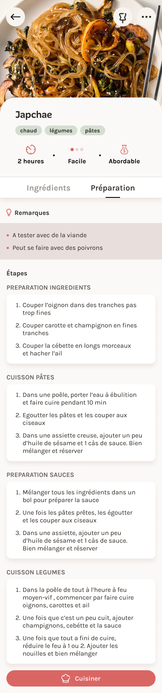
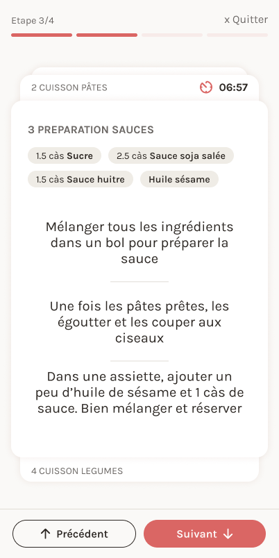

# Komi - Mobile Recipe & Cooking Companion

Komi is a thoughtful, user-centric mobile application designed to streamline home cooking. From managing personalized recipe collections to adjusting ingredient portions on the fly and guiding users through a distraction-free cooking mode, Komi brings modern product design principles into the kitchen.

---

## 🔑 Key Features

- **Recipe Management:** Create, edit, and categorize custom recipes with rich metadata (prep time, difficulty, cost, and tags).
- **Dynamic Portion Scaling:** Automatically recalculates ingredient quantities based on the number of servings needed.
- **Interactive Cooking Mode:** Step-by-step full-screen view featuring step-linked ingredient pills, integrated timers, and screen keep-awake functionality.  
(*my personnal favorite feature!*)
- **Smart Shopping List:** Add missing ingredients directly from recipe view into an organized shopping list.
- **Custom Design System:** Built from the ground up using custom Figma tokens and native styling.

---


## 🤖 AI-Assisted Development & Vibe Coding

This application was designed in Figma and fully implemented using **Cursor** (AI-first code editor) to demonstrate the power of AI-assisted engineering for Product Designers.

- **Figma to Code Pipeline:** Leveraged structured prompts and design system tokens to maintain strict visual fidelity from Figma components to React Native code.
- **Architectural Direction:** Prompted and orchestrated the entire application flow, state management (Zustand), and system edge cases through Cursor.
- **Rapid Prototyping:** Translated complex UX mechanics (dynamic portion scaling, stack-based cooking cards, screen wake locks) into production-ready React Native logic in record time.

---


## 📸 Screenshots









---


## 🚀 Getting Started

### Run Komi on your phone

Want to try Komi on your own phone? Follow these steps.

### Prerequisites

Ensure you have Node.js installed and the **Expo Go** app on your iOS or Android device.

### 1. Clone the repository

```
git clone https://github.com/YOUR-USERNAME/komi.git
cd komi
```

### 2. Start the app

In the project folder, run:

```
npx expo start
```

A QR code will appear in your terminal.

### 3. Open Komi

Make sure your phone and computer are connected to the **same Wi-Fi network**.

- **iPhone:** open the Camera app and scan the QR code.
- **Android:** open Expo Go and scan the QR code.

Komi should then open on your phone.

> **Note:** This is a development build running through Expo Go.

